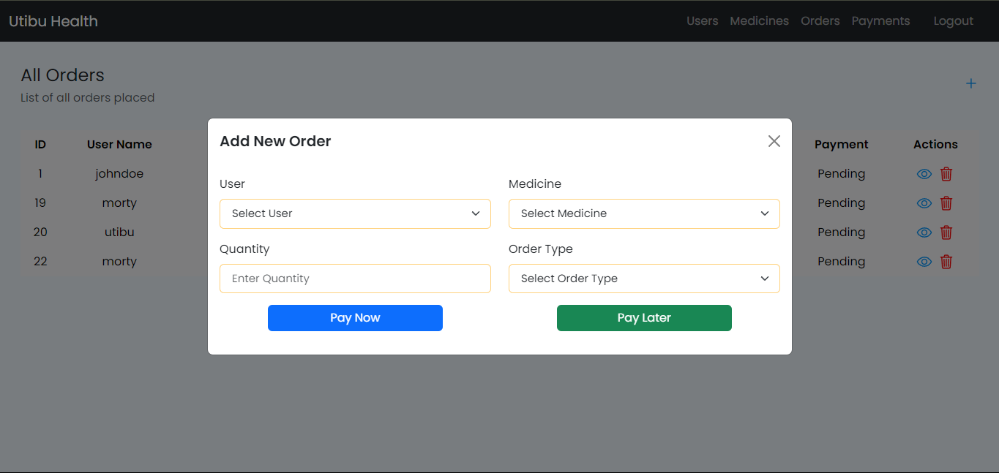

# Stellar Compass




## Utibu Health

Utibu Health is a health facility catering to patients with chronic conditions such as HIV, diabetes, and hypertension. The facility allows stable patients to remotely order medication and check their statements via a mobile app. This solution aims to streamline the medication ordering process and integrate online orders with the existing legacy database system.

## Table of Contents

- [Introduction](#introduction)
- [Features](#features)
- [Installation](#installation)
- [Usage](#usage)
- [Technologies Used](#technologies-used)
- [Contributing](#contributing)
- [License](#license)

## Introduction

Utibu Health's mobile app provides registered patients with the convenience of ordering medication remotely. Patients can view their statements and place orders without visiting the health facility in person. The app integrates seamlessly with the existing legacy database system, ensuring that online orders are synchronized with face-to-face sales.

## Features

- **User Authentication**: Secure authentication system for registered patients.
- **Medication Ordering**: User-friendly interface for placing medication orders remotely.
- **Order Status Tracking**: Ability to track the status of medication orders in real-time.
- **Statement Viewing**: Access to medication purchase history and statements.
- **Legacy Database Integration**: Seamless integration with the existing legacy database system for maintaining order records.

## Installation

Before running the application, ensure you have the following prerequisites installed:

- Node.js (React JS) and npm (for client-side)
- Python and pip (for server-side)

Follow these steps to set up and run the project:

1. **Clone the repository**:

   ```bash
   git clone https://github.com/mugambi12/stellar-compass.git
   ```

2. **Install dependencies**:

   - Server-side (Flask):

   ```bash
   cd stellar-compass/server
   python -m venv venv
   venv\Scripts\activate
   pip install -r requirements.txt
   ```

   - Client-side (React):

   ```bash
   cd stellar-compass/client
   npm install
   ```

3. **Start the client and server**:

   - Server-side (Flask):

   ```bash
   python run.py
   ```

   - Client-side (React):

   ```bash
   npm start
   ```

4. **Access the application**:

   Once both the client and server are running, access the application by navigating to [http://localhost:3000](http://localhost:3000) in your web browser.

## Usage

Once the application is installed and running, registered patients can log in to the mobile app, view their medication history, place orders, and track the status of their orders. Pharmacy staff can monitor and fulfill online orders through the legacy database system.

## Technologies Used

- **Client-side**:

  - React
  - Bootstrap
  - React Router
  - Fetch (for API requests)

- **Server-side**:
  - Flask
  - Flask-RESTful
  - Flask-JWT-Extended
  - SQLAlchemy (for database interaction)

## Contributing

Contributions to the Utibu Health project are welcome!

## License

This project is licensed under the [MIT License](LICENSE).
